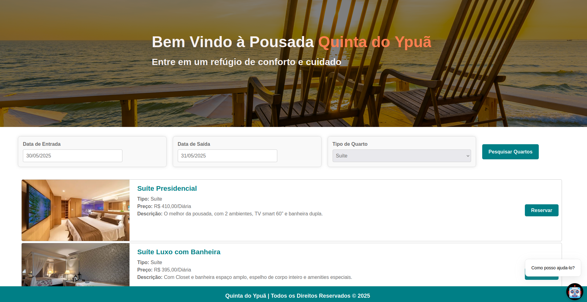
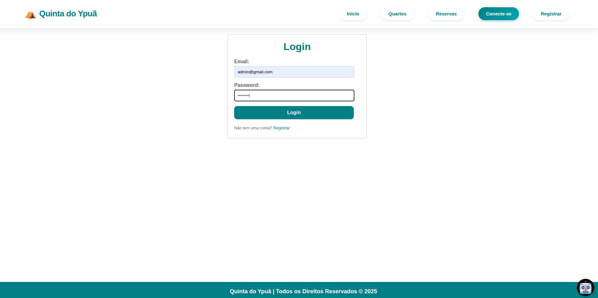
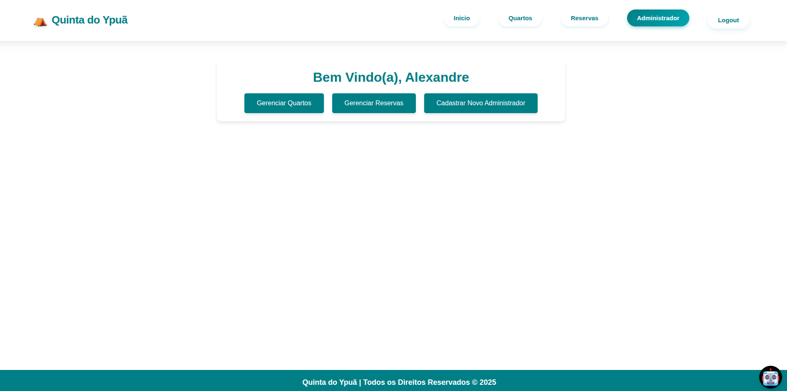
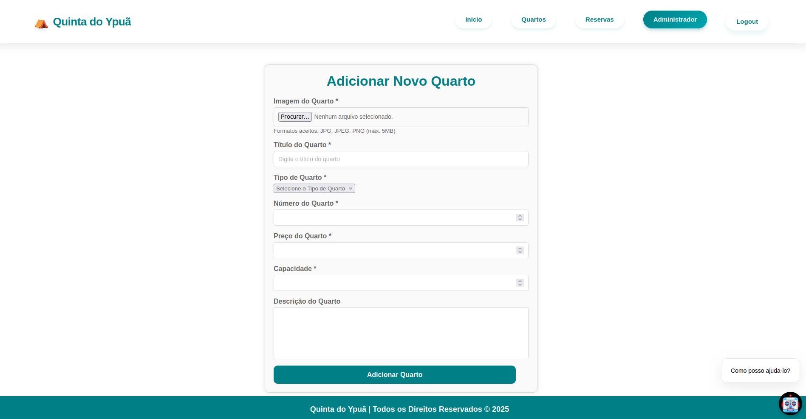

<br>

<br>

<p align="center">
  <a href="https://portfolio-3-d-olive.vercel.app/"></a>
</p>

<div align='center'>
  <h3> 
    Bem Vindo ao Projeto 
    
  </h3>   
</div>

<br>


<p align="center">
  <a href="https://portfolio-3-d-olive.vercel.app/">
    
  </a>
</p>

<br>

<br><br>

## 💡 Visão Geral

O **Sistema de Gerenciamento de Hospedagem - Quinta do Ypuã** é uma solução digital desenvolvida para modernizar e otimizar o processo de reservas em pousadas. O projeto permite uma administração completa dos quartos, clientes, pagamentos e reservas, tanto para o hóspede quanto para os administradores da pousada. O sistema consiste em:

- **Backend**: API RESTful desenvolvida em Spring Boot (Java)
- **Frontend**: Aplicação web desenvolvida em React.js
- **Banco de Dados**: PostgreSQL


## 🌐 Link de Acesso

- [🔗 Acesse o projeto em produção](https://quinta-do-ypua.netlify.app/home)

---

## 🛠️ Tecnologias Utilizadas

### Backend (Spring Boot)
- Java 21
- Spring Boot 3.4.1
- Spring Security
- JWT para autenticação
- PostgreSQL
- ModelMapper
- Lombok
- Stripe API para pagamentos
- Spring Mail
- Swagger
- Junit
- Mokito

### Frontend (React.js)
- React 18
- React Router
- Axios para requisições HTTP
- CSS Modules
- Responsive Design

## ⚙️ Funcionalidades Principais

### 👤 Para Hóspedes
- ✅ Pesquisa de quartos disponíveis por datas
- ✅ Cadastro e login de usuários
- ✅ Reserva de quartos online
- ✅ Pagamento via cartão de crédito (Stripe)
- ✅ Visualização de reservas ativas
- ✅ Edição de perfil
- ✅ Recebimento de e-mails de confirmação

### 🔒 Para Administradores
- ✅ CRUD completo de quartos
- ✅ Gerenciamento de reservas
- ✅ Controle de status de pagamentos
- ✅ Dashboard administrativo
- ✅ Cadastro de novos administradores

## 🧱 Estrutura do Projeto

### Backend (HotelBackend)
```
src/
├── main/
│   ├── java/com/example/HotelBooking/
│   │   ├── config/          # Configurações do Spring
│   │   ├── controllers/     # Controladores REST
│   │   ├── dtos/            # Objetos de Transferência de Dados
│   │   ├── entities/        # Entidades JPA
│   │   ├── enums/           # Enumeradores
│   │   ├── exceptions/      # Tratamento de exceções
│   │   ├── payments/stripe/ # Integração com Stripe
│   │   ├── repositories/    # Interfaces JPA
│   │   ├── security/        # Configurações de segurança
│   │   ├── services/        # Lógica de negócios
│   │   └── HotelBookingApplication.java
│   └── resources/           # Arquivos de configuração
```

### Frontend (HotelFrontend)
```
src/
├── component/
│   ├── admin/               # Componentes administrativos
│   ├── auth/                # Autenticação
│   ├── booking_rooms/       # Reservas e quartos
│   ├── common/              # Componentes compartilhados
│   ├── home/                # Página inicial
│   ├── payment/             # Pagamentos
│   └── profile/             # Perfil do usuário
├── service/                 # Serviços API e autenticação
└── App.js                   # Componente principal
```
##  Manual de Uso


### 1. Página Inicial


Na página inicial, os usuários podem:
- Visualizar informações sobre a pousada
- Pesquisar quartos disponíveis por datas
- Navegar para login ou registro

### 2. Pesquisa de Quartos


Selecione as datas de check-in e check-out, e o tipo de quarto desejado.

### 3. Resultados da Pesquisa


Visualize os quartos disponíveis para as datas selecionadas.

### 4. Registro de Usuário


Crie uma conta para fazer reservas.

### 5. Login


Acesse sua conta para gerenciar reservas.

### 6. Detalhes do Quarto


Visualize detalhes e faça reservas.

### 7. Reserva de Quarto


Confirme as datas e faça sua reserva.

### 8. Confirmação por E-mail


Receba o link de pagamento por e-mail.

### 9. Pagamento


Efetue o pagamento com cartão de crédito.

### 10. Confirmação de Pagamento


Receba a confirmação do pagamento.

### 11. Status da Reserva


Acompanhe o status de suas reservas.

### 12. Perfil do Usuário


Edite seu perfil e veja suas reservas.

<br><br>

<br><br>

## 🛡️ Área Administrativa

### 13. Dashboard Administrativo


Acesso completo às funcionalidades administrativas.

### 14. Cadastro de Quartos


Cadastre novos quartos no sistema.

### 15. Edição de Quartos


Atualize informações dos quartos.

### 16. Gerenciamento de Reservas


Controle o status das reservas e pagamentos.


## 🧭 Como Clonar e Executar o Projeto

## 📋 Pré-requisitos

- Java 21 (para o backend)
- Maven (para o backend)
- Node.js e npm (para o frontend)
- PostgreSQL (banco de dados)
- IntelliJ IDEA (recomendado para o backend)
- VS Code (recomendado para o frontend)

### 1️⃣ Clonando o Repositório

```bash
git clone https://github.com/AlexandreLiberatto/Pousada.git
cd Pousada
```

A estrutura do projeto será:

```
Pousada/
├── HotelBackend/       # Backend Spring Boot
│   ├── src/
│   ├── pom.xml
│   ├── .env
│   └── ...
├── hotelfrontend/      # Frontend React.js
│   ├── src/
│   ├── package.json
│   ├── .env
│   └── ...
└── README.md
```

### 2️⃣ Configuração do Banco de Dados

1. Crie um banco de dados no PostgreSQL com o nome `hotel`:

```sql
CREATE DATABASE hotel;
```

2. Não é necessário criar tabelas manualmente - o Spring Boot fará isso automaticamente através do JPA/Hibernate

### 3️⃣ Configuração do Backend (Spring Boot)

1. Abra a pasta `HotelBackend` no IntelliJ IDEA
2. Configure o arquivo `.env`


3. Execute no terminal:

```bash
./mvnw install
```

4. Inicie a aplicação:
   - Pela IDE (botão Run)
   - Ou pelo terminal: `./mvnw spring-boot:run`

O backend estará disponível em: http://localhost:9090

### 4️⃣ Configuração do Frontend (React.js)

1. Abra a pasta `hotelfrontend` no VS Code
2. Crie/configure o arquivo `.env` com:

```env
REACT_APP_API_URL=http://localhost:9090
```

3. Instale as dependências:

```bash
npm install
```

4. Inicie o servidor de desenvolvimento:

```bash
npm start
```

O frontend abrirá automaticamente em: http://localhost:3000


## 📝 Notas Importantes

1. O sistema criará automaticamente:
   - O usuário admin padrão
   - As tabelas do banco de dados
   - As estruturas básicas do sistema

2. Para produção, altere:
   - As credenciais do admin padrão
   - As chaves JWT e de API
   - As configurações de segurança


<br><br>

<br><br>

## Documentação da API


- Disponível em: [🔗 Documentação dinamica](http://localhost:9090/swagger-ui.html) 

- Obs: API precisa estar rodando localmente

<br><br>

<br><br>

## Contribuição

1. Faça um fork do projeto
2. Crie uma branch para sua feature (`git checkout -b feature/AmazingFeature`)
3. Commit suas mudanças (`git commit -m 'Add some AmazingFeature'`)
4. Push para a branch (`git push origin feature/AmazingFeature`)
5. Abra um Pull Request

## Licença

Distribuído sob a licença MIT. Veja `LICENSE` para mais informações.


<div align='center'>
  <h3> 
    Vamos nos Conectar 
    
  </h3>
    
</div>


<br><br>

<br><br>

##  Contatos

[](https://api.whatsapp.com/send?phone=+5548991604054)
[](https://www.linkedin.com/in/alexandre-liberato-32179624b/)
[](mailto:alexandreliberatto@gmail.com)


<br><br>

<br><br>

<div align='center'>
  Pegue as ondas, sinta ás vibrações positivas!
</div>
