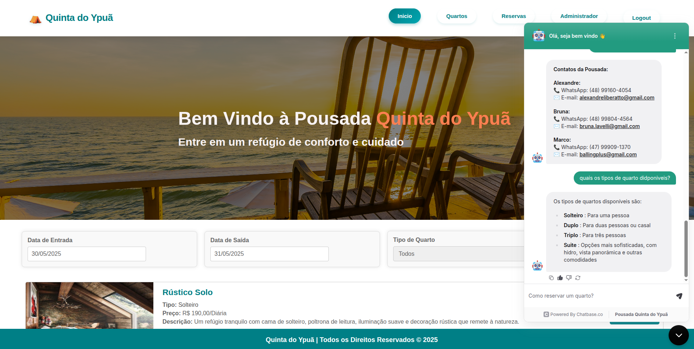
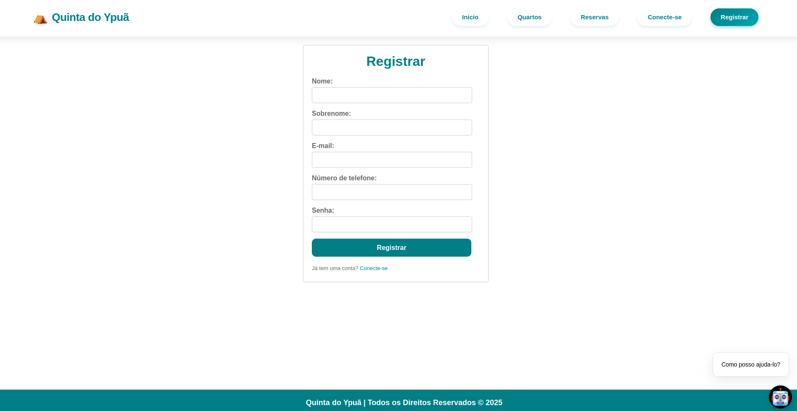
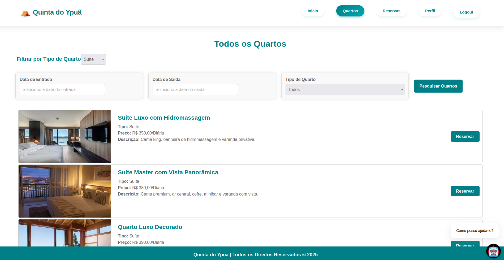
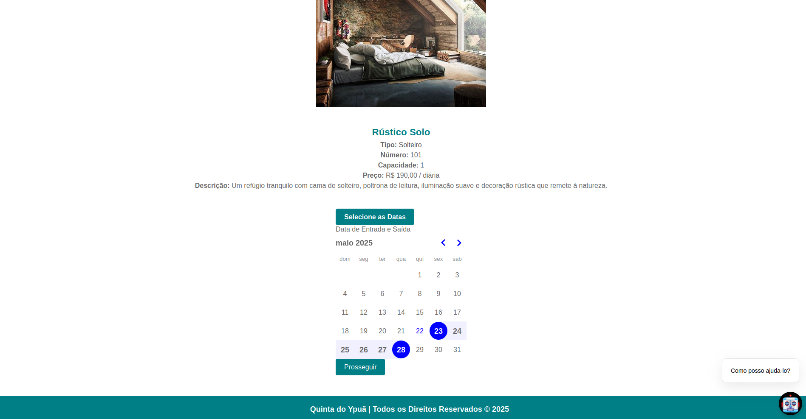
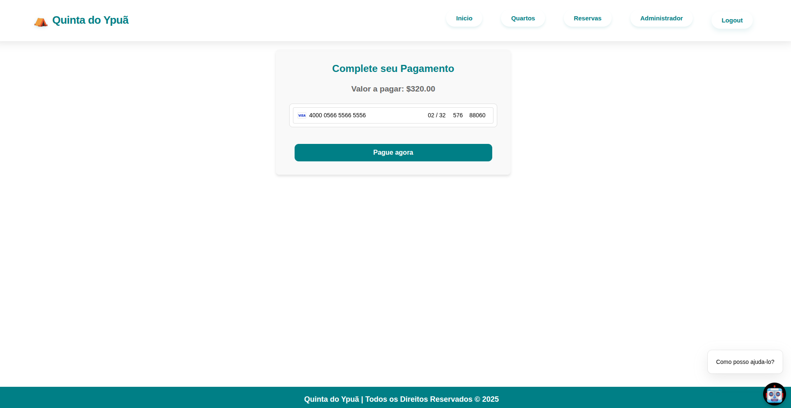
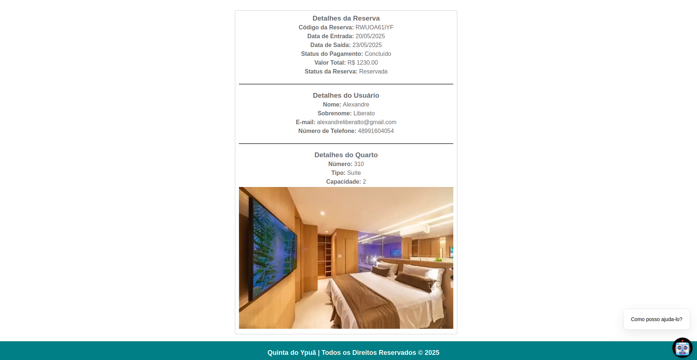

<br><br>

<br><br>

<p align="center">
  <a href="https://portfolio-3-d-olive.vercel.app/"></a>
</p>
<p align="center">
  <a href="https://portfolio-3-d-olive.vercel.app/"></a>
</p>
<p align="center">
  <a href="https://portfolio-3-d-olive.vercel.app/"></a>
</p>

<br><br>

<br><br>


<br><br>

<br><br>

## Visão Geral

O Sistema de Gerenciamento de Hospedagem da Pousada Quinta do Ypuã é uma solução completa para reservas online, gerenciamento de quartos e administração de pagamentos. O sistema consiste em:

- **Backend**: API RESTful desenvolvida em Spring Boot (Java)
- **Frontend**: Aplicação web desenvolvida em React.js
- **Banco de Dados**: PostgreSQL

## Link de Acesso

- **Projeto em Produção**: [Acesse o Site](https://quinta-do-ypua.netlify.app/home)

## Tecnologias Utilizadas

### Backend (Spring Boot)
- Java 21
- Spring Boot 3.4.1
- Spring Security
- JWT para autenticação
- PostgreSQL
- ModelMapper
- Lombok
- Stripe API para pagamentos
- Spring Mail

### Frontend (React.js)
- React 18
- React Router
- Axios para requisições HTTP
- CSS Modules
- Responsive Design

## Funcionalidades Principais

### Para Hóspedes
- ✅ Pesquisa de quartos disponíveis por datas
- ✅ Cadastro e login de usuários
- ✅ Reserva de quartos online
- ✅ Pagamento via cartão de crédito (Stripe)
- ✅ Visualização de reservas ativas
- ✅ Edição de perfil
- ✅ Recebimento de e-mails de confirmação

### Para Administradores
- ✅ CRUD completo de quartos
- ✅ Gerenciamento de reservas
- ✅ Controle de status de pagamentos
- ✅ Dashboard administrativo
- ✅ Cadastro de novos administradores

## Estrutura do Projeto

### Backend (HotelBackend)
```
src/
├── main/
│   ├── java/com/example/HotelBooking/
│   │   ├── config/          # Configurações do Spring
│   │   ├── controllers/     # Controladores REST
│   │   ├── dtos/            # Objetos de Transferência de Dados
│   │   ├── entities/        # Entidades JPA
│   │   ├── enums/           # Enumeradores
│   │   ├── exceptions/      # Tratamento de exceções
│   │   ├── payments/stripe/ # Integração com Stripe
│   │   ├── repositories/    # Interfaces JPA
│   │   ├── security/        # Configurações de segurança
│   │   ├── services/        # Lógica de negócios
│   │   └── HotelBookingApplication.java
│   └── resources/           # Arquivos de configuração
```

### Frontend (HotelFrontend)
```
src/
├── component/
│   ├── admin/               # Componentes administrativos
│   ├── auth/                # Autenticação
│   ├── booking_rooms/       # Reservas e quartos
│   ├── common/              # Componentes compartilhados
│   ├── home/                # Página inicial
│   ├── payment/             # Pagamentos
│   └── profile/             # Perfil do usuário
├── service/                 # Serviços API e autenticação
└── App.js                   # Componente principal
```

## Manual de Uso

### 1. Página Inicial


Na página inicial, os usuários podem:
- Visualizar informações sobre a pousada
- Pesquisar quartos disponíveis por datas
- Navegar para login ou registro

### 2. Pesquisa de Quartos


Selecione as datas de check-in e check-out, e o tipo de quarto desejado.

### 3. Resultados da Pesquisa


Visualize os quartos disponíveis para as datas selecionadas.

### 4. Registro de Usuário


Crie uma conta para fazer reservas.

### 5. Login


Acesse sua conta para gerenciar reservas.

### 6. Detalhes do Quarto


Visualize detalhes e faça reservas.

### 7. Reserva de Quarto


Confirme as datas e faça sua reserva.

### 8. Confirmação por E-mail


Receba o link de pagamento por e-mail.

### 9. Pagamento


Efetue o pagamento com cartão de crédito.

### 10. Confirmação de Pagamento


Receba a confirmação do pagamento.

### 11. Status da Reserva


Acompanhe o status de suas reservas.

### 12. Perfil do Usuário


Edite seu perfil e veja suas reservas.

## Área Administrativa

### 13. Dashboard Administrativo


Acesso completo às funcionalidades administrativas.

### 14. Cadastro de Quartos


Cadastre novos quartos no sistema.

### 15. Edição de Quartos


Atualize informações dos quartos.

### 16. Gerenciamento de Reservas


Controle o status das reservas e pagamentos.

## Configuração e Deploy

### Backend
1. Configure as variáveis de ambiente no arquivo `.env`
2. Build: `mvn clean package`
3. Execute: `java -jar target/Pousada-0.0.1-SNAPSHOT.jar`

### Frontend
1. Configure as variáveis de ambiente no arquivo `.env`
2. Instale dependências: `npm install`
3. Execute em desenvolvimento: `npm start`
4. Build para produção: `npm run build`

## Contribuição

1. Faça um fork do projeto
2. Crie uma branch para sua feature (`git checkout -b feature/AmazingFeature`)
3. Commit suas mudanças (`git commit -m 'Add some AmazingFeature'`)
4. Push para a branch (`git push origin feature/AmazingFeature`)
5. Abra um Pull Request

## Licença

Distribuído sob a licença MIT. Veja `LICENSE` para mais informações.

<br>

<div align='center'>
  <h3> 
    Vamos nos Conectar 
    
  </h3>
    
</div>


<br><br>

<br><br>

##  Contatos

[](https://api.whatsapp.com/send?phone=+5548991604054)
[](https://www.linkedin.com/in/alexandre-liberato-32179624b/)
[](mailto:alexandreliberatto@gmail.com)


<br><br>

<br><br>

<div align='center'>
  Pegue as ondas, sinta ás vibrações positivas!
</div>
